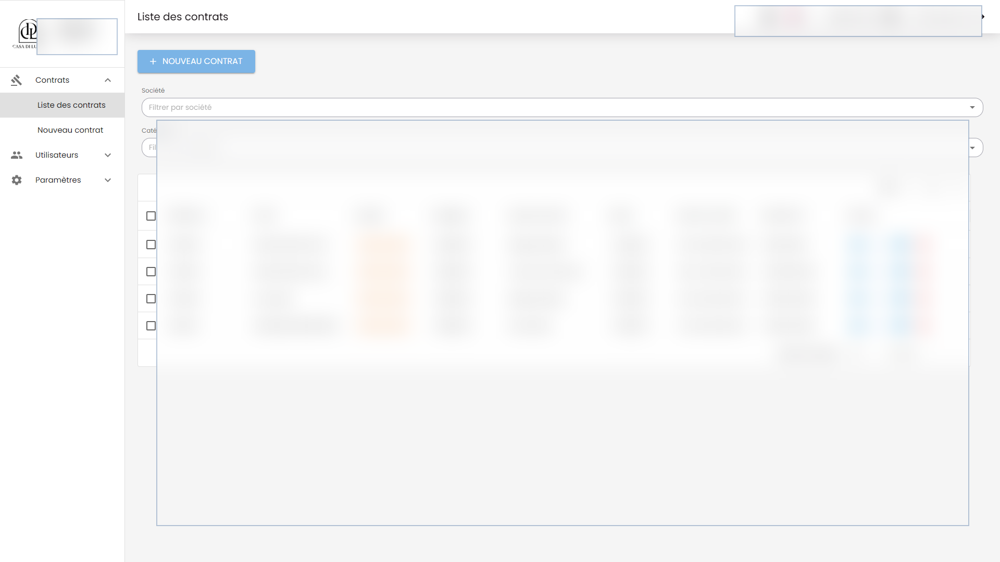

# Contracts Frontend

Next.js interface for a contract document platform for creating, managing, generating, editing, and tracking contract records, files, notifications, users, and document outputs.

This frontend is built around real staff workflows: authenticated navigation, dense dashboards, tables, filters, create/edit/detail pages, forms, actions, settings, notifications, and production data constraints.

## What It Shows

- Product UI work for an internal business system.
- Data-heavy React/Next.js screens with real workflow depth.
- State management with Redux Toolkit and redux-saga.
- Authenticated app structure with NextAuth and API-backed routes.
- Form, table, dashboard, notification, and settings flows built for daily operations.

## Key Capabilities

- Next.js dashboard for contract list, creation, detail, edit, users, notifications, profile, password, and settings screens.
- MUI document workflow UI with forms, detail pages, action controls, localized text, and authenticated navigation.
- Redux Toolkit and redux-saga state flows for API calls, auth, contract actions, and notification handling.
- Formik/Zod validation around contract forms and user/settings flows.
- Jest and Testing Library tests for auth, contracts, validation, store, helpers, and route behavior.

## Stack

- Next.js 16, React 19, TypeScript
- NextAuth, Axios, React Redux
- Redux Toolkit, redux-saga
- MUI, MUI X Data Grid, Sass, chart components
- Formik, Zod, date-fns
- Jest, Testing Library, ts-jest, Bun

## Related Repository

- Backend API: [Altroo/contracts_backend](https://github.com/Altroo/contracts_backend)

## Screenshots

Redacted production screenshots. Sensitive names, amounts, dates, and records are blurred.




## Local Setup

Create local-only environment variables for the API base URL, auth settings, websocket endpoints, and public runtime config. Do not commit `.env` files or production credentials.

```bash
bun install
bun run dev
```

Default local port: `3001`.

## Quality Checks

```bash
bun x jest --runInBand --coverage=false
bun run lint
bun run build
```

## Portfolio Note

The repository is public for portfolio review. Screenshots are redacted, and sensitive production values are intentionally hidden.
