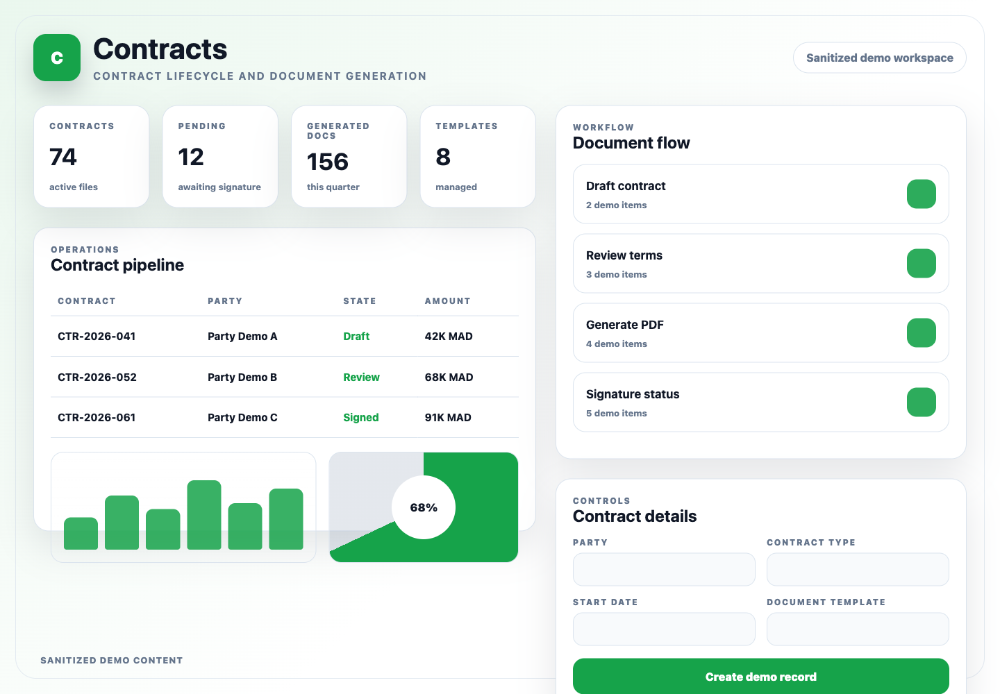
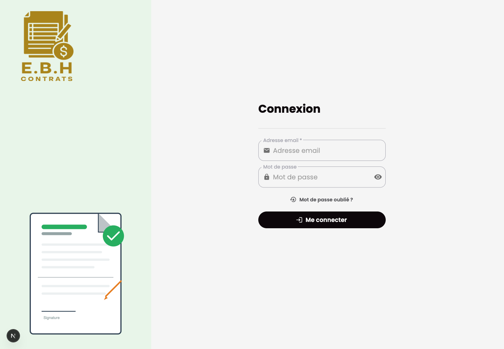

# Contracts Frontend

## Purpose

Contracts Frontend is the Next.js dashboard for contract administration. It provides authenticated screens for contracts, users, settings, notifications, and document workflows.

## Stack

- Next.js and React
- TypeScript
- NextAuth
- Redux Toolkit and redux-saga
- MUI and Sass
- Formik and Zod
- Jest and Testing Library

## Features

- Contract list, creation, and detail workflows
- User administration and profile settings
- Notification center
- Authentication and session handling
- Document-oriented dashboard navigation
- Localized interface text

## Setup

Provide local-only variables for the API, auth, and websocket endpoints. Use localhost values for local development and do not commit local configuration files.

```bash
bun install
bun run dev
```

The frontend runs on `localhost:3001`.

## Tests

```bash
bun x jest --runInBand --coverage=false
bun run lint
bun run build
```

## Screenshots

Sanitized product workspace:



Authentication screen:


